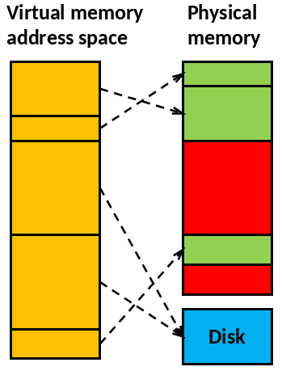
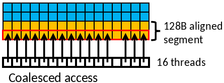
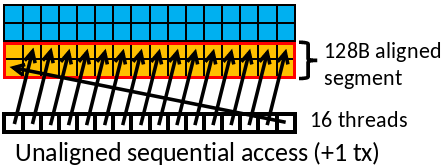

# Memory allocations, access, and unified memory {.section}

# Outline

* Memory model and hierarchy
* Memory management strategies
* Page-locked memory
* Coalesced memory access in device kernels


# Memory model

* Host and device have separate physical memories
* It is generally not possible to call malloc() to allocate memory and access
  the data from the GPU
* Memory management can be
    * Explicit (user manages the movement of the data and makes sure CPU and
      GPU pointers are not mixed)
    * Automatic, using Unified Memory (data movement is managed in the
      background by the Unified Memory driver)


# Data movement

* Data copies between host and device are slow
* To achieve best performance, the host-device data traffic should be minimized 
    * Initialize arrays on the GPU
    * Even if some pieces of the algorithm are better suited to the CPU, execute on the GPU to avoid moving data.
* Not copying data back and forth between CPU and GPU every step or iteration can have a large performance impact!
* When working with different data consider use a single malloc for worst case and reuse the same area: malloc is way slower than memcpy.


# Device memory hierarchy

<div class="column">
- Registers (per-thread-access)
- Local memory (per-thread-access)
- Shared memory (per-block-access)
- Global memory (global access)
</div>

<div class="column">
{width=80%}
</div>


# Device memory hierarchy

<div class="column">
- Registers (per-thread-access)
    - Used automatically
    - Size on the order of kilobytes
    - Very fast access
- Local memory (per-thread-access)
    - Used automatically if all registers are reserved
    - Local memory resides in global memory
    - Very slow access
    - Cached (but very small if compared to cpu cache!)
</div>

<div class="column">
- Shared memory (per-block-access)
    - Usage must be explicitly programmed
    - Size on the order of kilobytes
    - Fast access
- Global memory (per-device-access)
    - Managed by the host through HIP API
    - Size on the order of gigabytes
    - Very slow access
</div>


# Device memory hierarchy (advanced)

- There are more details in the memory hierarchy, some of which are
  architecture-dependent, e.g.,
    - Texture memory
    - Constant memory
- Complicates implementation
- Should be considered only when a very high level of optimization is
  desirable
- Match particular compute patterns


# Important memory operations

```cpp
// Allocate pinned device memory
hipError_t hipMalloc(void **devPtr, size_t size)

// Allocate Unified Memory; The data is moved automatically between host/device
hipError_t hipMallocManaged(void **devPtr, size_t size)

// Deallocate pinned device memory and Unified Memory
hipError_t hipFree(void *devPtr)

// Copy data (host-host, host-device, device-host, device-device)
hipError_t hipMemcpy(void *dst, const void *src, size_t count, enum hipMemcpyKind kind)
```

# Example of explicit memory management

```cpp
int main() {
 int *A, *d_A;
 A = (int *) malloc(N*sizeof(int));
 hipMalloc((void**)&d_A, N*sizeof(int));
 ...
 /* Copy data to GPU and launch kernel */
 hipMemcpy(d_A, A, N*sizeof(int), hipMemcpyHostToDevice);
 hipLaunchKernelGGL(...);
 ...
 hipMemcpy(A, d_A, N*sizeof(int), hipMemcpyDeviceToHost);
 hipFree(d_A);
 printf("A[0]: %d\n", A[0]);
 free(A);
 return 0;
}
```


# Example of Unified Memory

```cpp
int main() {
 int *A;
 hipMallocManaged((void**)&A, N*sizeof(int));
 ...
 /* Launch GPU kernel */
 hipLaunchKernelGGL(...);
 hipStreamSynchronize(0);
 ...
 printf("A[0]: %d\n", A[0]);
 hipFree(A);
 return 0;
}
```

# Unified Memory pros

- Allows incremental development
- Can increase developer productivity significantly
    - Especially large codebases with complex data structures
- Supported by the latest NVIDIA + AMD architectures
- Allows oversubscribing GPU memory on some architectures

# Unified Memory cons

- Data transfers between host and device are initially slower, but can be
  optimized once the code works
    - Through prefetches
    - Through hints
- Must still obey concurrency & coherency rules, not foolproof
- The performance on the AMD cards is an open question
- Easier to overlook optimization possibilities


# Unified Memory workflow for GPU offloading

1. Allocate memory for the arrays accessed by the GPU with
   `hipMallocManaged()` instead of `malloc()`
    - It is a good idea to have a wrapper function and use conditional compilation
      for memory allocations
2. Offload compute kernels to GPUs
3. Check profiler backtrace for GPU->CPU Unified Memory page-faults (NVIDIA
   Visual Profiler, Nsight Systems, AMD omniperf, rocprof)
    - This indicates where the data residing on the GPU is accessed by the CPU
      (very useful for large codebases, especially if the developer is new to
      the code)


# Unified Memory workflow for GPU offloading

4.  Move operations from CPU to GPU if possible, or use hints / prefetching
    (`hipMemAdvice()` / `hipMemPrefetchAsync()`)
    -  It is not necessary to eliminate all page faults, but eliminating the
       most frequently occurring ones can provide significant performance
       improvements
5.  Allocating GPU memory can have a much higher overhead than allocating
    standard host memory
    - If GPU memory is allocated and deallocated in a loop, consider using a
      GPU memory pool allocator for better performance


# Virtual Memory addressing

<div class="column">
- Modern operating systems utilize virtual memory
    - Memory is organized to memory pages
    - Memory pages can reside on swap area on the disk (or on the GPU with
      Unified Memory)
</div>

<div class="column">
{width=50%}
</div>

# Page-locked (or pinned) memory

- Normal `malloc()` allows swapping and page faults
- User can page-lock an allocated memory block to a particular physical memory
  location
- Enables Direct Memory Access (DMA)
- Higher transfer speeds between host and device
- Copying can be interleaved with kernel execution
- Page-locking too much memory can degrade system performance due to paging
  problems

# Allocating page-locked memory on host

- Allocated with `hipHostMalloc()` function instead of `malloc()`
- The allocation can be mapped to the device address space for device access
  (slow)
    - On some architectures, the host pointer to device-mapped allocation can
      be directly used in device code (i.e. it works similarly to Unified
      Memory pointer, but the access from the device is slow)
- Deallocated using `hipHostFree()`

# Asynchronous memcopies

- Normal `hipMemcpy()` calls are blocking (i.e. synchronizing)
    - The execution of host code is blocked until copying is finished
- To overlap copying and program execution, asynchronous functions are required
    - Such functions have *Async* suffix, e.g. `hipMemcpyAsync()`
- User has to synchronize the program execution
- Requires page-locked memory

# Asynchronous Malloc

- `hipMallocAsync()` and `hipFreeAsync()` allow the developer to:
	- treat memory allocation and free as asynchronous operations
	- use memory pool (i.e. subsequent alloc/frees are less expensive)

# Virtual Memory Management

- Experimental feature
- Allows to reallocate, i.e. change the size of the allocated memory without paying
free and allocation cost

- Reference: [https://docs.amd.com/bundle/HIP-API-Guide-v5.2/page/group___virtual.html](https://docs.amd.com/bundle/HIP-API-Guide-v5.2/page/group___virtual.html)

# Global memory access in device code

- Global memory access from the device is slow
- Threads are executed in warps, memory operations are grouped in a similar
  fashion
- Memory access is optimized for coalesced access where threads read from and
  write to successive memory locations
- Exact alignment rules and performance issues depend on the architecture

# Coalesced memory access

<div class="column">
- The global memory loads and stores consist of transactions of a certain size
  (e.g. 32 bytes)
- If the threads within a warp access data within such a block of 32 bytes,
  only one global memory transaction is needed
</div>

<div class="column">
- Now, 32 threads within a warp can each read a different 4-byte integer value
  with just 4 transactions
- When the stride between each 4-byte integer is increased, more transactions
  are required (up to 32 for the worst case)!
</div>

# Coalesced memory access example

<div class="column" style="width:49%;">
<p>
```
__global__ void memAccess(float *out, float *in)
{
 int tid = blockIdx.x*blockDim.x + threadIdx.x;
 if(tid != 12) out[tid + 16] = in[tid + 16];
}
```
</p>
<p>
{width=80%}
</p>
</div>

<div class="column" style="width:49%">
<p>
```
__global__ void memAccess(float *out, float *in)
{
 int tid = blockIdx.x*blockDim.x + threadIdx.x;
 out[tid + 1] = in[tid + 1];
}
```
</p>
<p>
{width=80%}
</p>
</div>


# Summary

- Host and device have separate physical memories
- Using Unified Memory can improve developer productivity and result in a
  cleaner implementation
- The number of data copies between CPU and GPU should be minimized
    - With Unified Memory, if data transfer cannot be avoided, using hints or
      prefetching to mitigate page faults is beneficial
- Coalesced memory access in the device code is recommended for better
  performance
