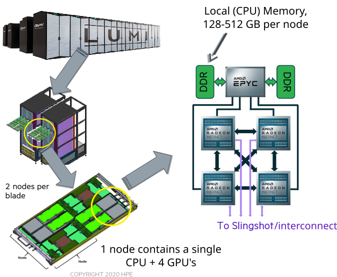
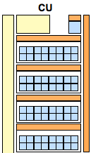

# Accelerator model today


- Local memory in GPU
    - Smaller than main memory (32 GB in Puhti, 64GB in LUMI)
    - Very high bandwidth (up to 3200 GB/s in LUMI)
    - Latency high compared to compute performance

{width=100%}

- GPUs are connected to CPUs via PCIe
- Data must be copied from CPU to GPU over the PCIe bus


# Lumi - Pre-exascale system in Finland

 {.center width=50%}


# GPU architecture
<div class="column">
- Designed for running tens of thousands of threads simultaneously on
  thousands of cores
- Very small penalty for switching threads
- Running large amounts of threads hides memory access penalties
- Very expensive to synchronize all threads
</div>

<div class="column">

<small>AMD Instinct MI100 architecture (source: AMD)</small>
</div>


#  Heterogeneous Programming Model

- GPUs are co-processors to the CPU
- CPU controls the work flow:
  - *offloads* computations to GPU by launching *kernels*
  - allocates and deallocates the memory on GPUs
  - handles the data transfers between CPU and GPUs
- CPU and GPU can work concurrently
   - kernel launches are normally asynchronous

# Example: axpy

<div class="column">

Serial cpu code of `y=y+a*x`:

- have a loop going over the each index


<small>
```cpp
void axpy_(int n, double a, double *x, double *y)
{
    for(int id=0;id<n; id++) {
        y[id] += a * x[id];
    }
}
```
</small>
</div>

<div class="column">

On a accelerator:

- no loop 
- we create instances of the same function, **kernels**
<small>

```cpp
GPU_K void axpy_(int n, double a, double *x, double *y, int id)
{
        y[id] += a * x[id]; // id<n
}

```
</small>

</div>

# A Grid of Threads is Launched on a Device

<div class="column">


{.center width=44%}

<div align="center"><small>A grrid of threads executing the same **kernel**</small></div>

</div>

<div class="column">
{.center width=65%}

<div align="center"><small>AMD Instinct MI100 architecture (source: AMD)</small></div>
</div>

- a grid of threads is launched on a specififc device to perform a given work. 
- each thread executes the same kernel processing different elemtns of the data.

# A Work-Group is Assigned to a Compute Unit

<div class="column">


{.center width=35%}

<div align="center"><small>Work-groups of threads</small></div>

</div>

<div class="column">
{.center width=35%}

<div align="center"><small>Compute Unit in an AMD GPU.</small></div>
</div>

# Summary

