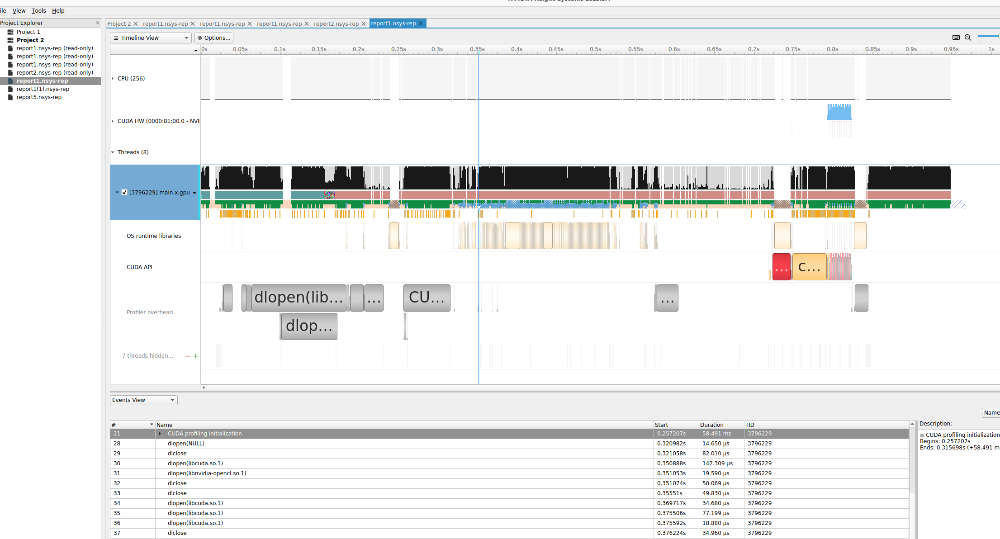

# We want to compile and run with debug options for profiling
## we are using a Nbody interaction example

- Compile the program with the following options for run on the nvidia GPU
```bash
icpx -fsycl -fsycl-targets=nvptx64-nvidia-cuda -O3 -o main.x.gpu main.cpp GSimulation.cpp
```

Put your compile script togetger, if you like, you can also compile for both targets, AMD CPU and NVIDIA GPU
at the same time. This makes your binary jut a bit bigger.

# Now we have to call nsys with
```bash
nsys profile ./main.x.gpu
```
Change the above command accordingly to run the program on an nvidia GPU!
<br>

# This generates a profile report which can be observed with nsys-ui
## You have to download the report to your own computer and open it
## with nsys-ui! And you have our profiling report!
# That means, you have to install nsys on your own computer,
# on Linux you have to install nvidia sdk, please look it up for
# your own system.

# The target for this hands on is, that you generate one or more profiles and have a look at them

# Application Parameters for the Nbody program

### You can modify the NBody sample simulation parameters in GSimulation.cpp. Configurable parameters include:
Parameter Defaults
- set_npart 	Default number of particles is 16000
- set_nsteps 	Default number of integration steps is 10
- set_tstep 	Default time delta is 0.1
- set_sfreq 	Default sample frequency is 1
<br>
It is possible to use command linearguments for
```C++
int main(int argc, char** argv)
{
  int n;      // number of particles
  int nstep;  // number ot integration steps

  GSimulation sim;

#ifdef DEBUG
  char* env = std::getenv("SYCL_BE");
  std::cout << "[ENV] SYCL_BE = " << (env ? env : "<not set>") << "\n";
#endif

  if (argc > 1)
  {
    n = std::atoi(argv[1]);
    sim.SetNumberOfParticles(n);
    if (argc == 3) {
      nstep = std::atoi(argv[2]);
      sim.SetNumberOfSteps(nstep);
    }
  }

  sim.Start();

  return 0;
}
```
### so with command line arguments one can set npart and nsteps by
```bash
./main.x.gpu 16000 10  
```

### example output with the default parameters
```bash
===============================
Initialize Gravity Simulation
Target Device: Intel(R) Gen9
nPart = 16000; nSteps = 10; dt = 0.1
------------------------------------------------
s       dt      kenergy     time (s)    GFLOPS
------------------------------------------------
1       0.1     26.405      0.28029     26.488
2       0.2     313.77      0.066867    111.03
3       0.3     926.56      0.065832    112.78
4       0.4     1866.4      0.066153    112.23
5       0.5     3135.6      0.065607    113.16
6       0.6     4737.6      0.066544    111.57
7       0.7     6676.6      0.066403    111.81
8       0.8     8957.7      0.066365    111.87
9       0.9     11587       0.066617    111.45
10      1       14572       0.06637     111.86

# Total Time (s)     : 0.87714
# Average Performance : 112.09 +- 0.56002
===============================
Built target run
```

<br>

### After you have generated the report, e.g. report1.nsys-rep, download the file and start

```bash
nsys-ui
```

### Then you can open the file report1.nsys-rep. It should look like the pic below!


