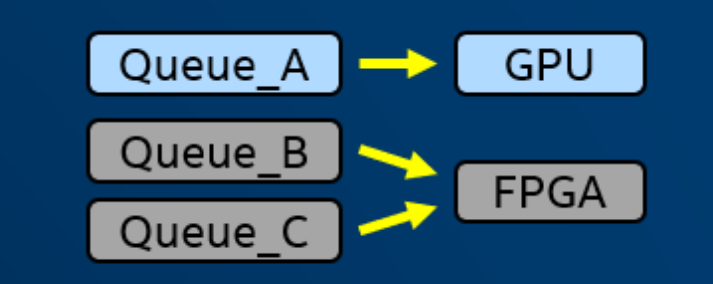

# SYCL Program Structure
> What is SYCL and Data Parallel C++?
>
> SYCL Classes
>
> - Device
> - Code: Device Selector
> - Queue
> - Kernel
>
> Parallel Kernels
> - Basic Parallel Kernels
> - ND-Range Kernels
> Memory Models
>
> - Code: Vector Add implementation using USM and Buffers
> - Unified Shared Memory Model
> - Buffer Memory Model
> -- Code: Synchronization: Host Accessor
> -- Code: Synchronization: Buffer Destruction
>
> Code: Custom Device Selector
>
> Multi-GPU Selection
>
> Code: Complex Number Multiplication
>
> Lab Exercise: Vector Add

## Learning Objectives
- Explain the SYCL fundamental classes
- Use device selection to offload kernel workloads
- Decide when to use basic parallel kernels and ND Range Kernels
- Use Unified Shared Memory or Buffer-Accessor memory model in SYCL program
- Build a sample SYCL application through hands-on lab exercises

## What is SYCL and Data Parallel C++?
SYCL is an open standard to program for heterogeneous devices in a single source. A SYCL program is invoked on
the host computer and offloads the computation to an accelerator. Programmers use familiar C++ and library
constructs with added functionalities like a queue for work targeting, buffer or Unified Shared Memory for data
management, and parallel_for for parallelism to direct which parts of the computation and data should be
offloaded. Data Parallel C++ (DPC++) is oneAPI's implementation of SYCL.
<br>
## SYCL Language and Runtime
SYCL language and runtime consists of a set of C++ classes, templates, and libraries.

### Application scope and command group scope:
- Code that executes on the host
- The full capabilities of C++ are available at application and command group scope
<br>
### Kernel scope:
- Code that executes on the device.
- At kernel scope there are limitations in accepted C++
<br>
Let's look at a simple SYCL code to offload computation to GPU, the code does the following:
1) selects GPU device for offload
2) allocates memory that can be accessed on host and GPU
3) initializes data array on host
4) offloads computation to GPU
5) prints output on host

```C++
#include <sycl/sycl.hpp>

static const int N = 16;

int main()
{
    sycl::queue q(sycl::gpu_device_selector_v); // <--- select GPU for offload
    int *data = sycl::malloc_shared<int>(N, q); // <--- allocate memory
    
    for(int i=0; i<N; i++) data[i] = i;
    q.parallel_for(N, [=] (auto i)
    {
        data[i] *= 2; // <--- Kernel Code (executes on GPU)
    }).wait();
    
    for(int i=0; i<N; i++) std::cout << data[i] << "\n";
    sycl::free(data, q);
    
    return 0;
}
```

Programs which use SYCL requires the include of the header file sycl/sycl.hpp.
<br>
In the next few sections we will learn the basics of C++ SYCL programming.
<br>
### SYCL Classes
Below are some important SYCL Classes that are used to write a C++ with SYCL program to offload computation
to heterogeneous devices.
<br>
### Device
The device class represents the capabilities of the accelerators in a system utilizing Intel® oneAPI Toolkits. The
device class contains member functions for querying information about the device, which is useful for SYCL programs
where multiple devices are created.
- The function get_info gives information about the device:
- Name, vendor, and version of the device
- The local and global work item IDs
- Width for built in types, clock frequency, cache width and sizes, online or offline

```C++
queue q;
device my_device = q.get_device();
std::cout << "Device: " << my_device.get_info<info::device::name>() << "\n";
```
### Device Selector
These classes enable the runtime selection of a particular device to execute kernels based upon user-provided
heuristics. The following code sample shows use of the standard device selectors (default_selector_v,
cpu_selector_v, gpu_selector_v, accelerator_selector_v)


```C++
queue q(gpu_selector_v);
//queue q(cpu_selector_v);
//queue q(accelerator_selector_v);
//queue q(default_selector_v);
//queue q;
std::cout << "Device: " << q.get_device().get_info<info::device::name>() << "\n";
```

## Exercise 1
1. Inspect the code in sycl1-lab/gpu_sample.cpp file showing different device selectors in use.

2. On Intel Developer Cloud machine, please make sure that the environment is set:

3. Compile and run the code example with -fsycl option:
```Bash
icpx -fsycl gpu_sample.cpp -o gpu_sample
./gpu_sample
```
>- You should get the device you are working on

4. Use cpu_selector_v instead of gpu_selector_v, recompile and rerun the code:

5. Use the default queue constructor and check what happens at runtime in that case.

### Queue
Queue submits command groups to be executed by the SYCL runtime. Queue is a mechanism where work is
submitted to a device.A queue map to one device and multiple queues can be mapped to the same device.

```C++
q.submit([&](handler& h)
{
    //COMMAND GROUP CODE
});
```

### Kernel
The kernel class encapsulates methods and data for executing code on the device when a command group is
instantiated. Kernel object is not explicitly constructed by the user and is constructed when a kernel dispatch
function, such as parallel_for, is called


```C++
q.submit([&](handler& h)
{
    h.parallel_for(range<1>(N), [=](id<1> i)
    {
        A[i] = B[i] + C[i]);
    });
});
```

### Choosing where device kernels run
Work is submitted to queues and each queue is associated with exactly one device (e.g. a specific GPU, CPU or
FPGA). You can decide which device a queue is associated with (if you want) and have as many queues as desired
for dispatching work in heterogeneous systems.

| Target Device                                               | Queue              | 
| ------------------------------------------------------------| ------------------ |
| Create queue targeting any device:                          | queue()            |
| Create queue targeting a pre-configured classes of devices: | queue(cpu_selector_v); queue(gpu_selector_v); queue(accelerator_selector_v); queue(default_selector_v); |
| Create queue targeting specific device (custom criteria):   | queue(custom_selector);    |




```C++

```

```C++

```

```C++

```

```Bash

```

```Bash

```

