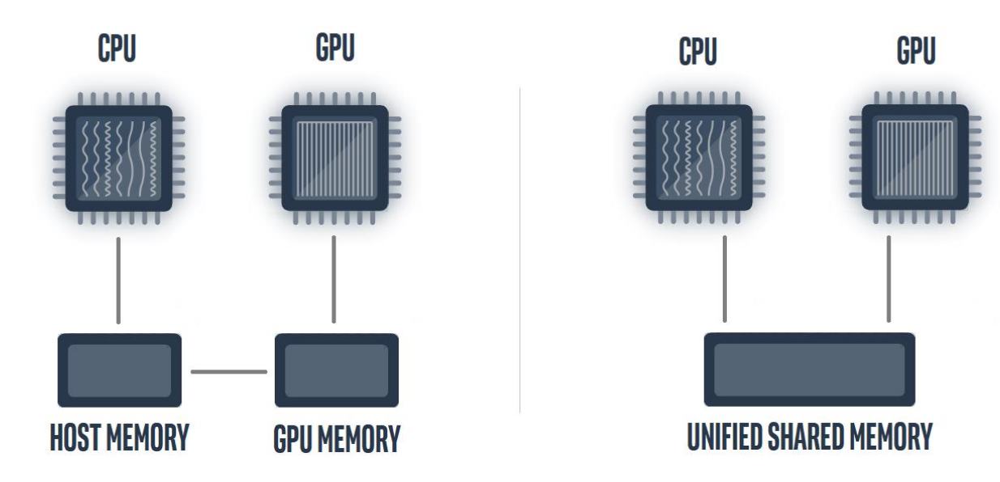

# SYCL2 LAB 
We will be working on Mahti and or Lumi, this is up to you!
You are all responsible for the jobscripts, Christian put examples for this on Github.
You can of course work interactively.
<br>
For all the exercises you have to write some code, compile the program and then run the program.
There are suggested solutions but don't look at them to early.
First try to solve it yourself.
<br>
# LAB2: get your hands dirty:

# Unified Shared Memory (USM)
- What is USM?
- Types of USM
- Code: Implicit USM
- Code: Explicit USM
- Data Dependency in USM
- Code: Data Dependency in-order queues
- Code: Data Dependency out-of-order queues
- Lab Exercise: Unified Shared Memory
<br>

## Learning Objectives
- Use new SYCL2020 features such as Unified Shared Memory to simplify programming.
- Understand implicit and explicit way of moving memory using USM.
- Solve data dependency between kernel tasks in optimal way.
<br>

## What is Unified Shared Memory?
Unified Shared Memory (USM) is a pointer-based memory management in SYCL. USM is a pointer-based approach that
should be familiar to C and C++ programmers who use malloc or new to allocate data. USM simplifies development for
the programmer when porting existing C/C++ code to SYCL.
<br>

## Developer view of USM
The picture below shows developer view of memory without USM and with USM.
<br>
With USM, the developer can reference that same memory object in host and device code.


## Types of USM
Unified shared memory provides both explicit and implicit models for managing memory.


## USM Syntax
USM Initialization: The initialization below shows example of shared allocation using malloc_shared, the "q" queue
parameter provides information about the device that memory is accessible.
<br>
```c++
int *data = malloc_shared<int>(N, q);
```

OR you can use familiar C++/C style malloc:

```c++
int *data = static_cast<int *>(malloc_shared(N * sizeof(int), q));
```

## Freeing USM:
```c++
free(data, q);
```

## USM Implicit Data Movement
The SYCL code below shows an implementation of USM using malloc_shared, in which data movement happens implicitly
between host and device. Useful to get functional quickly with minimum amount of code and developers will not
having worry about moving memory between host and device.
The SYCL code below demonstrates USM Implicit Data Movement:

```c++
#include <sycl/sycl.hpp>

using namespace sycl;
static const int N = 16;

int main()
{
    queue q;
    std::cout << "Device : " << q.get_device().get_info<info::device::name>() << "\n";
    //# USM allocation using malloc_shared
    int *data = malloc_shared<int>(N, q);
    //# Initialize data array
    for (int i = 0; i < N; i++) data[i] = i;
        
    //# Modify data array on device
    q.parallel_for(range<1>(N), [=](id<1> i) { data[i] *= 2; }).wait();

    //# print output
    for (int i = 0; i < N; i++) std::cout << data[i] << "\n";
        
    free(data, q);
    return 0;
        
}
```

# Exercises USM
## usm1
1. Inspect the code in usm/usm.cpp file.
2. Compile and run this code using our jobscripts for offloading to our nvidia GPUs.

## USM Explicit Data Movement
The SYCL code below shows an implementation of USM using malloc_device, in which data movement between host and
device should be done explicitly by developer using memcpy. This allows developers to have more controlled
movement of data between host and device.
<br>
The SYCL code below demonstrates USM Explicit Data Movement:

```c++
#include <sycl/sycl.hpp>

using namespace sycl;
static const int N = 16;

int main()
{
    queue q;
    std::cout << "Device : " << q.get_device().get_info<info::device::name>() << "\n";

    //# initialize data on host
    int *data = static_cast<int *>(malloc(N * sizeof(int)));
    
    for (int i = 0; i < N; i++) data[i] = i;

    //# Explicit USM allocation using malloc_device
    int *data_device = malloc_device<int>(N, q);

    //# copy mem from host to device
    q.memcpy(data_device, data, sizeof(int) * N).wait();
    
    //# update device memory
    q.parallel_for(range<1>(N), [=](id<1> i) { data_device[i] *= 2; }).wait();
    
    //# copy mem from device to host
    q.memcpy(data, data_device, sizeof(int) * N).wait();
    
    //# print output
    for (int i = 0; i < N; i++) std::cout << data[i] << "\n";
    
    free(data_device, q);
    free(data);

    return 0;
}
```


